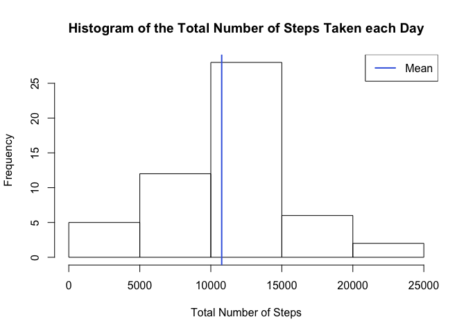

# Reproducible Reaserch: Course Project 1

For this project we will analyze data from personal activity monitor device and 
analyze the different patterns of use during the day.

###Loading and preprocessing the data

We first load the data provided for the activity monitor device.

```r
# Read CSV File
origActivity <- read.csv("activity.csv")
```

###What is mean total number of steps taken per day?

We then calculate the total number of steps taken per day

```r
# Calculate total steps
stepsPerDay <- aggregate(origActivity$steps, by=list(date=origActivity$date), 
                         FUN=sum)
```

Instead of using a column named "x" we will rename the column to "steps"

```r
# Change column name
colnames(stepsPerDay)[2] <- c("steps")
```

The mean of the total number of steps taken per day is:

```r
# Calculate total steps mean
totalStepsMean <- mean(stepsPerDay$steps, na.rm = TRUE)
totalStepsMean
```

```
## [1] 10766.19
```

The  median of the total number of steps taken per day is:

```r
#Calculate total steps median
totalStepsMedian <- median(stepsPerDay$steps, na.rm = TRUE)
totalStepsMedian
```

```
## [1] 10765
```

Below is a histogram of the total number of steps taken each day

```r
# Display histogram
hist(stepsPerDay$steps, 
     main = "Histogram of the Total Number of Steps Taken each Day", 
     xlab="Total Number of Steps", ylab="Frequency")
# Draw Vertical Mean Line
abline(v = totalStepsMean, col = "royalblue", lwd = 2)
# Draw Legend
legend(x = "topright", c("Mean"), col = c("royalblue"), lwd = c(2))
```

 

###What is the average daily activity pattern?

To get the average, we get the sum of the steps for every interval.

```r
# Calculate the average number of steps
stepsAverage <- tapply(origActivity$steps, factor(origActivity$interval), FUN = mean, 
                  na.rm = TRUE)
```

Get the unique intervals for the plot

```r
# Get the unique intervals
uniqueIntervals <- unique(origActivity$interval)
```

We then plot the average steps

```r
# Draw averages plot
plot(uniqueIntervals, stepsAverage, type = "l", xlab = "5-min Intervals", 
     ylab ="Average Number of Steps", 
     main = "Average Number of Steps Taken for 5-minute intervales")
```

 

On average, across all the days in the dataset, the 5-minute interval that 
contains the maximum number of steps is:

```r
# Get max interval
names(which.max(stepsAverage))
```

```
## [1] "835"
```

###Imputing missing values

The total number of missing values in the dataset (i.e. the total number of 
rows with NAs) is:

```r
# Get sum of missing values
sum(is.na(origActivity$steps))
```

```
## [1] 2304
```

In order to fill in these missing values, we will take the average for the day 
and replace the missing values:

```r
# Get unique list of dates
uniqueDates <- unique(origActivity$date)

# Create an empty data frame
cleanActivity <- data.frame(row.names = uniqueIntervals)

# Loop through the dates to fill data frame
for(date in uniqueDates) {
        cleanActivity <- cbind(cleanActivity,
                               date=origActivity[origActivity$date %in% date,]$steps)
}

# Set data frame columns
colnames(cleanActivity) <- uniqueDates

# Get indexes of missing values
missingValueRows <- which(is.na(cleanActivity), arr.ind=TRUE)

# Fill missing values with means of rows.
cleanActivity[missingValueRows] <- 
        rowMeans(cleanActivity,  na.rm = TRUE)[missingValueRows[,1]]
```

We then recreate a new dataset that is equal to the original dataset but with 
the missing data filled in.

```r
# Create an empty data frame
completeActivity <- data.frame(steps=integer(), date=factor(), 
                               interval=integer())

# Loop through dates to fill in data frame
for(date in uniqueDates) {
        steps <- data.frame(steps=cleanActivity[date], date=date, 
                            interval=row.names(cleanActivity))
        rownames(steps) <- NULL
        names(steps) <- names(origActivity)
        completeActivity <- rbind(completeActivity, steps)
}
```

We then calculate the imputed total number of steps taken per day

```r
# Get total number of steps
stepsPerDayComplete <- aggregate(completeActivity$steps, 
                                 by=list(date=completeActivity$date), FUN=sum)
```

Instead of using a column named "x" we will rename the column to "steps"

```r
# Change column name
colnames(stepsPerDayComplete)[2] <- c("steps")
```

The imputed mean of the total number of steps taken per day is:

```r
# Calculate imputed mean
totalStepsMeanComplete <- mean(stepsPerDayComplete$steps, na.rm = TRUE)
totalStepsMeanComplete
```

```
## [1] 10766.19
```

The imputed median of the total number of steps taken per day is:

```r
# Calculate imputed median
totalStepsMedianComplete <- median(stepsPerDayComplete$steps, na.rm = TRUE)
totalStepsMedianComplete
```

```
## [1] 10766.19
```

Below is a histogram of the total number of steps taken each day

```r
# Draw Histogram
hist(stepsPerDayComplete$steps, 
     main = "Imputed Histogram of the Total Number of Steps Taken each Day", 
     xlab="Total Number of Steps", ylab="Frequency")
# Draw mean in vertical line
abline(v = totalStepsMeanComplete, col = "royalblue", lwd = 2)
# Draw the legend
legend(x = "topright", c("Mean"), col = c("royalblue"), lwd = c(2))
```

 

**Imputing missing data makes the median the same as the mean.**

###Are there differences in activity patterns between weekdays and weekends?

To see if there are differences, we will first add a number of new columns

```r
# Convert date to date class
completeActivity$date <- as.Date(completeActivity$date, "%Y-%m-%d")

# Add weedday column
completeActivity$day <- weekdays(completeActivity$date)

# Add weekday type column
completeActivity$type <- c("weekday")
completeActivity[completeActivity[, "day"] == "Saturday",]$type <- c("weekend")
completeActivity[completeActivity[, "day"] == "Sunday",]$type <- c("weekend")
completeActivity[, 'type'] <- as.factor(completeActivity[, 'type'])

# Calculate the daily average number of steps for the weekday
averageSteps <- aggregate(steps ~ interval, subset = type == "weekday", 
                            data = completeActivity, FUN = mean)
averageSteps$type <- "weekday"

# Calculate the daily average number of steps for the weekend
weekendAverage <- aggregate(steps ~ interval, subset = type == "weekend", 
                            data = completeActivity, FUN = mean)
weekendAverage$type <- "weekend"

# Join both results into a single data frame and sort them
averageSteps <- rbind(averageSteps, weekendAverage)
averageSteps[, 'interval'] <- as.numeric(as.character(averageSteps[, 'interval']))
averageSteps <- averageSteps[ order(averageSteps[,1]), ]
rownames(averageSteps) <- NULL
```

We will now make a panel plot containing a time series plot (i.e. type = "l") of the 5-minute interval (x-axis) and the average number of steps taken, averaged across all weekday days or weekend days (y-axis). 


```r
library(lattice)

# Display chart
xyplot(steps~interval|type, data = averageSteps, type = "l",
       main="Average Number of Steps Taken for 5-minute Intervals", 
          ylab = "Number of Steps", xlab="Interval", layout = c(1, 2))
```

 

